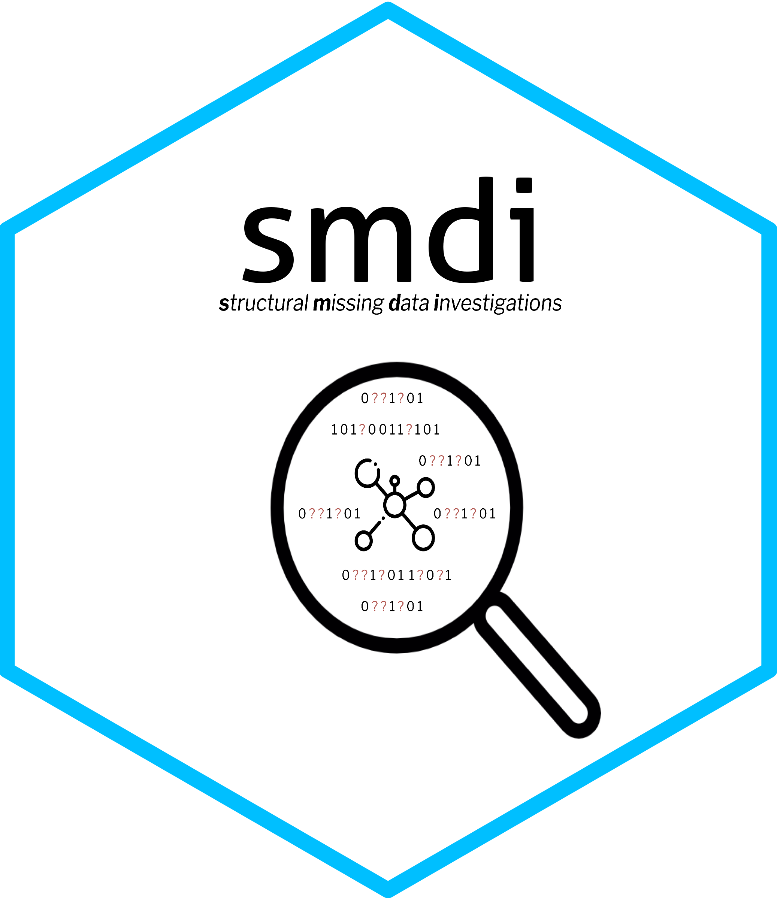

# smdi 

**`S`tructural `M`issing `D`ata `I`nvestigations**

[](https://cran.rstudio.com/web/packages/smdi/index.html)

This package aims to be a helpful addition to routine healthcare database analytics with a focus on structural missing data investigations.


## Installation

*package still in progress, come back later*

You can install the latest version of `smdi` with:

```r
remotes::install_github("https://gitlab-scm.partners.org/janickweberpals/smdi")
```

## Package website

Check out the `smdi` pkgdown website:

<https://janickweberpals.gitlab-pages.partners.org/smdi>

## Vignettes

To learn how to use the `smdi` R package, refer to the package vignettes:

```r
utils::browseVignettes("smdi")
```
