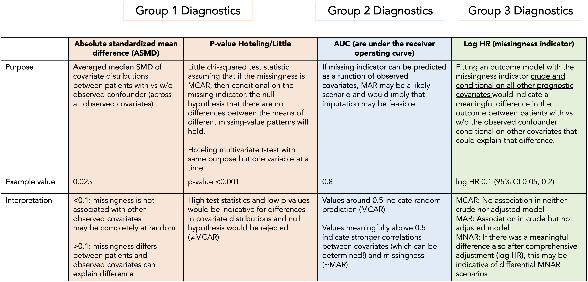

# smdi 

<style>
p.comment {
background-color: #DBDBDB;
padding: 10px;
border: 1px solid black;
margin-left: 25px;
border-radius: 5px;
font-style: italic;
}
</style>

**`S`tructural `M`issing `D`ata `I`nvestigations**

This package aims to be a helpful addition to routine healthcare database analytics with a focus on structural missing data investigations.

The theoretical backbone of this package is based on a large-scale plasmode simulation performed by the [Sentinel Innovation Center workgroup](https://www.sentinelinitiative.org/methods-data-tools/methods/approaches-handling-partially-observed-confounder-data-electronic-health) on

**Approaches to Handling Partially Observed Confounder Data From Electronic Health Records (EHR) In Non-randomized Studies of Medication Outcomes.**

*The manuscript is underway and will be referenced here as soon as it becomes available. The cornerstones of this project are outlined below.*

::: {style="color:red"}
Please note that this version is currently in beta testing phase and no major decisions should be based on this package. If you encounter any unforeseen errors or have any suggestions, comments or recommendations, please feel free to reach out to [jweberpals\@bwh.harvard.edu](mailto:jweberpals@bwh.harvard.edu) or [open an issue](https://gitlab-scm.partners.org/janickweberpals/smdi/-/issues).
:::

## Installation

You can install the latest release version of `smdi` using the `devtools` package via:

``` r
devtools::install_git("https://gitlab-scm.partners.org/janickweberpals/smdi.git")
```

To install the development version, please use the `dev` branch:

``` r
devtools::install_git("https://gitlab-scm.partners.org/janickweberpals/smdi.git", ref = "dev")
```

Once beta testing has completed, we plan to submit the package to CRAN. Stay tuned!

## About

<div class="alert alert-info">
<strong>Objectives:</strong> The objectives of this project were to develop a framework and tools to assess the structure of missing data processes in studies utilizing electronic health record (EHR) data.
</div>

Missing data in important prognostic factors in EHR are frequent. So far, the most frequent data taxonomies are:

- **Mechanisms**: Missing completely at random (MCAR), at random (MAR) and not at random (MNAR)
- **Patterns**: Monotone, Non-monotone

However, in an empirical study, it is usually unclear which of the missing data mechanisms and patterns are dominating.

<div class="alert alert-info">
  <strong>What did the study find?</strong> In brief, these large-scale simulations revealed characteristic patterns of the diagnostic parameters matched to missing data structure based on three group diagnostics:
</div>

-   **Group diagnostic 1:** Comparison of distributions between patients with or without an observed value of the partially observed covariate

-   **Group diagnostic 2:** Assessing the ability to predict missingness based on observed covariates

-   **Group diagnostic 3:** Estimating if the missingness of a covariate is associated with the outcome (differential missingness)



<div class="alert alert-info">
  <strong>How can this be applied to inform a real-world database study?</strong> The observed diagnostic pattern of a specific study will give insights into the likelihood of underlying missingness structures. This is how an **example** could look like in a real-world database study:
</div>


While the manuscript is underway, in the meantime please refer to the presentation at the 2023 Innovation Day to learn more

<iframe width="750" height="421.875" src="https://www.youtube.com/embed/Dml_AP0ohTY?start=7376" title="YouTube video player" frameborder="0" allow="accelerometer; autoplay; clipboard-write; encrypted-media; gyroscope; picture-in-picture; web-share" allowfullscreen></iframe>

## Package website

Check out the `smdi` pkgdown website:

[janickweberpals.gitlab-pages.partners.org/smdi](https://janickweberpals.gitlab-pages.partners.org/smdi)

## References

*This project builds up on pivotal work done by several groups and recently published frameworks and guidance papers*

Lee KJ, Tilling KM, Cornish RP, Little RJA, Bell ML, Goetghebeur E, Hogan JW, Carpenter JR; STRATOS initiative. Framework for the treatment and reporting of missing data in observational studies: The Treatment And Reporting of Missing data in Observational Studies framework. J Clin Epidemiol. 2021 Jun;134:79-88. doi: 10.1016/j.jclinepi.2021.01.008. Epub 2021 Feb 2. PMID: 33539930; PMCID: PMC8168830.

Carpenter JR, Smuk M. Missing data: A statistical framework for practice. Biom J. 2021 Jun;63(5):915-947. doi: 10.1002/bimj.202000196. Epub 2021 Feb 24. PMID: 33624862.

Sondhi A$^1$, Weberpals J$^1$, Yerram P, Jiang C, Taylor MD, Samant M, Cherng S. A Systematic Approach Towards Missing Lab Data in Electronic Health Records: A Case Study in Non-Small Cell Lung Cancer and Multiple Myeloma. CPT Pharmacometrics Syst Pharmacol. 2023 (accepted)
