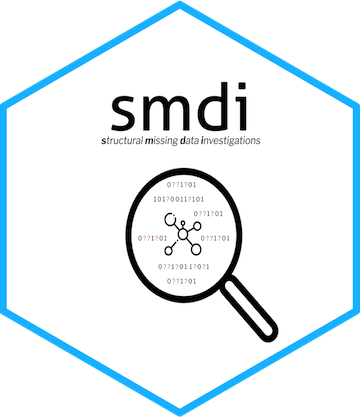

# smdi

This package aims to be a helpful addition to routine healthcare database analytics with a focus on structural missing data investigations.

# Installation guidance

*package still in progress, come back later*
